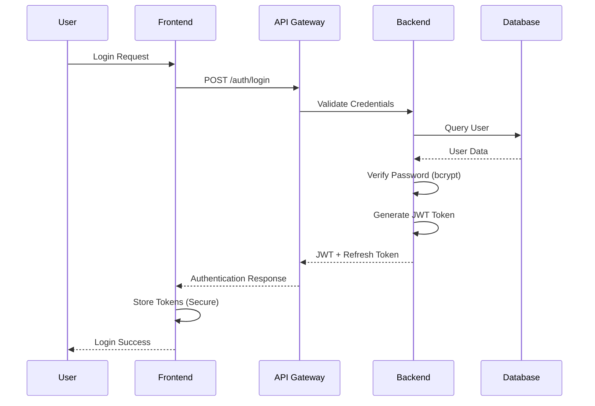

# AutoSec Security Architecture

This document outlines the security architecture, design principles, and implementation details of the AutoSec cybersecurity platform.

## 🛡️ Security Design Principles

### Defense in Depth
AutoSec implements multiple layers of security controls:
- **Perimeter Security**: Network-level protection and access controls
- **Application Security**: Secure coding practices and input validation
- **Data Security**: Encryption at rest and in transit
- **Identity Security**: Strong authentication and authorization
- **Operational Security**: Monitoring, logging, and incident response

### Zero Trust Architecture
- **Never Trust, Always Verify**: Every request is authenticated and authorized
- **Least Privilege Access**: Minimal required permissions for each user/service
- **Micro-segmentation**: Network isolation between components
- **Continuous Monitoring**: Real-time security event analysis

### Security by Design
- **Secure Defaults**: Secure configurations out of the box
- **Fail Securely**: System failures default to secure state
- **Privacy by Design**: Data protection built into system architecture
- **Threat Modeling**: Systematic security risk assessment

## 🏗️ Architecture Overview

### Security Zones

```
┌─────────────────────────────────────────────────────────────┐
│                    Internet/External Zone                   │
└─────────────────────┬───────────────────────────────────────┘
                      │
┌─────────────────────▼───────────────────────────────────────┐
│                     DMZ Zone                                │
│  ┌───────────────┐  ┌─────────────────┐  ┌───────────────┐  │
│  │  Load Balancer│  │  Web Application│  │  API Gateway  │  │
│  │   (Nginx)     │  │   Firewall      │  │   (Express)   │  │
│  └───────────────┘  └─────────────────┘  └───────────────┘  │
└─────────────────────┬───────────────────────────────────────┘
                      │
┌─────────────────────▼───────────────────────────────────────┐
│                Application Zone                             │
│  ┌───────────────┐  ┌─────────────────┐  ┌───────────────┐  │
│  │   Backend     │  │   Frontend      │  │   ML Engine   │  │
│  │   Services    │  │   Application   │  │   Services    │  │
│  └───────────────┘  └─────────────────┘  └───────────────┘  │
└─────────────────────┬───────────────────────────────────────┘
                      │
┌─────────────────────▼───────────────────────────────────────┐
│                   Data Zone                                 │
│  ┌───────────────┐  ┌─────────────────┐  ┌───────────────┐  │
│  │  PostgreSQL   │  │    MongoDB      │  │     Redis     │  │
│  │   Database    │  │    Database     │  │     Cache     │  │
│  └───────────────┘  └─────────────────┘  └───────────────┘  │
└─────────────────────────────────────────────────────────────┘
```

### Component Security Model

#### Frontend Security
- **Content Security Policy (CSP)**: Prevents XSS attacks
- **Secure Headers**: HSTS, X-Frame-Options, X-Content-Type-Options
- **Input Validation**: Client-side validation with server-side verification
- **Session Management**: Secure session handling with JWT tokens
- **HTTPS Only**: All communication encrypted with TLS 1.3

#### API Gateway Security
- **Authentication**: JWT-based authentication with refresh tokens
- **Authorization**: Role-based access control (RBAC)
- **Rate Limiting**: DDoS and brute-force protection
- **Input Validation**: Comprehensive request validation
- **API Security**: OpenAPI 3.0 specification with security schemas

#### Backend Services Security
- **Service Mesh**: Encrypted inter-service communication
- **Secrets Management**: Environment-based secret handling
- **Database Security**: Connection pooling with encrypted connections
- **Logging Security**: Sanitized logs without sensitive data
- **Error Handling**: Secure error responses without information disclosure

#### Data Layer Security
- **Encryption at Rest**: Database-level encryption
- **Encryption in Transit**: TLS for all database connections
- **Access Control**: Database-level user permissions
- **Backup Security**: Encrypted backups with secure key management
- **Data Masking**: Sensitive data obfuscation in non-production environments

## 🔐 Authentication and Authorization

### Authentication Flow



### JWT Token Structure
```json
{
  "header": {
    "alg": "HS256",
    "typ": "JWT"
  },
  "payload": {
    "sub": "user123",
    "email": "user@example.com",
    "role": "analyst",
    "permissions": ["read:logs", "create:rules"],
    "iat": 1640995200,
    "exp": 1641081600
  },
  "signature": "HMACSHA256(base64UrlEncode(header) + '.' + base64UrlEncode(payload), secret)"
}
```

### Role-Based Access Control (RBAC)

#### Roles and Permissions

**Admin Role**
- `admin:*` - Full system administration
- `user:*` - User management
- `rule:*` - Security rule management
- `system:*` - System configuration
- `analytics:*` - Analytics and reporting

**Analyst Role**
- `rule:read`, `rule:create`, `rule:update` - Rule management
- `log:read`, `log:search` - Log analysis
- `analytics:read` - Analytics viewing
- `threat:read`, `threat:analyze` - Threat analysis

**Viewer Role**
- `dashboard:read` - Dashboard viewing
- `log:read` - Log viewing
- `analytics:read` - Analytics viewing
- `rule:read` - Rule viewing

#### Permission Enforcement
```javascript
// Middleware for permission checking
const requirePermission = (permission) => {
  return (req, res, next) => {
    const userPermissions = req.user.permissions;
    
    if (!userPermissions.includes(permission) && 
        !userPermissions.includes('admin:*')) {
      return res.status(403).json({
        error: 'Insufficient permissions'
      });
    }
    
    next();
  };
};

// Usage in routes
router.get('/rules', 
  authenticateToken, 
  requirePermission('rule:read'), 
  getRules
);
```

### Multi-Factor Authentication (MFA)

#### TOTP Implementation
- **Algorithm**: HMAC-SHA1 based Time-based One-Time Password
- **Secret Length**: 160-bit cryptographically secure random secret
- **Time Step**: 30-second intervals
- **Window**: ±1 time step tolerance for clock skew
- **Backup Codes**: Cryptographically secure backup codes

```javascript
const speakeasy = require('speakeasy');

// Generate MFA secret
const generateMFASecret = (user) => {
  const secret = speakeasy.generateSecret({
    name: user.email,
    issuer: 'AutoSec',
    length: 20
  });
  
  return {
    secret: secret.base32,
    qrCode: secret.otpauth_url
  };
};

// Verify MFA token
const verifyMFAToken = (token, secret) => {
  return speakeasy.totp.verify({
    secret: secret,
    encoding: 'base32',
    token: token,
    window: 1
  });
};
```

## 🔒 Data Protection

### Encryption Standards

#### At Rest Encryption
- **Database**: AES-256 encryption for sensitive data
- **File Storage**: Server-side encryption with customer-managed keys
- **Backups**: Encrypted backups with separate key management
- **Logs**: Sanitized logs with PII/PHI redaction

#### In Transit Encryption
- **TLS 1.3**: All HTTP communications
- **Database Connections**: SSL/TLS encrypted connections
- **Inter-Service**: mTLS for service-to-service communication
- **Message Queues**: TLS encryption for RabbitMQ

#### Key Management
- **Key Rotation**: Automatic key rotation every 90 days
- **Key Storage**: Hardware Security Module (HSM) or secure key vault
- **Key Derivation**: PBKDF2 with SHA-256 and 100,000 iterations
- **Key Access**: Least privilege access to encryption keys

### Data Classification

#### Sensitive Data Types
1. **Authentication Data**
   - Passwords (bcrypt hashed)
   - JWT secrets
   - MFA secrets
   - Session tokens

2. **Personal Information**
   - User emails
   - IP addresses (potentially PII)
   - Geolocation data
   - Device fingerprints

3. **Security Data**
   - Threat intelligence
   - Security logs
   - Vulnerability data
   - Incident reports

#### Data Handling Policies
```javascript
// Data sanitization for logs
const sanitizeLogData = (data) => {
  const sensitive = ['password', 'token', 'secret', 'key'];
  
  return Object.keys(data).reduce((acc, key) => {
    if (sensitive.some(s => key.toLowerCase().includes(s))) {
      acc[key] = '[REDACTED]';
    } else {
      acc[key] = data[key];
    }
    return acc;
  }, {});
};

// Database field encryption
const encryptSensitiveField = (value, key) => {
  const cipher = crypto.createCipher('aes-256-gcm', key);
  let encrypted = cipher.update(value, 'utf8', 'hex');
  encrypted += cipher.final('hex');
  return encrypted;
};
```

## 🚨 Threat Model

### Threat Landscape

#### External Threats
1. **Remote Attackers**
   - Web application attacks (SQLi, XSS, CSRF)
   - API abuse and unauthorized access
   - DDoS and resource exhaustion
   - Social engineering and phishing

2. **Malicious Software**
   - Malware and ransomware
   - Advanced Persistent Threats (APTs)
   - Zero-day exploits
   - Supply chain attacks

#### Internal Threats
1. **Privileged Users**
   - Administrator abuse
   - Accidental data exposure
   - Configuration errors
   - Weak password practices

2. **System Vulnerabilities**
   - Software vulnerabilities
   - Misconfigured services
   - Unpatched systems
   - Weak encryption

### Attack Vectors and Mitigations

#### Web Application Attacks
**SQL Injection**
- Mitigation: Parameterized queries, ORM usage, input validation
- Detection: WAF rules, database monitoring

**Cross-Site Scripting (XSS)**
- Mitigation: Input sanitization, CSP headers, output encoding
- Detection: XSS scanning, content validation

**Cross-Site Request Forgery (CSRF)**
- Mitigation: CSRF tokens, SameSite cookies, origin validation
- Detection: Request pattern analysis

#### API Security
**Authentication Bypass**
- Mitigation: Strong JWT validation, token expiration, refresh tokens
- Detection: Failed authentication monitoring

**Authorization Escalation**
- Mitigation: RBAC enforcement, permission validation
- Detection: Privilege usage monitoring

**Rate Limit Bypass**
- Mitigation: Distributed rate limiting, IP-based limits
- Detection: Traffic pattern analysis

#### Infrastructure Attacks
**Container Escape**
- Mitigation: Container hardening, AppArmor/SELinux
- Detection: Container runtime monitoring

**Network Segmentation Bypass**
- Mitigation: Network policies, firewall rules
- Detection: Network traffic analysis

## 🔍 Security Monitoring

### Security Event Correlation

#### Log Sources
1. **Application Logs**
   - Authentication events
   - Authorization failures
   - API access logs
   - Error logs

2. **System Logs**
   - OS security events
   - Network connections
   - Process execution
   - File system changes

3. **Security Tool Logs**
   - WAF alerts
   - IDS/IPS events
   - Vulnerability scans
   - Threat intelligence

#### Real-time Monitoring
```javascript
// Security event detection
const detectSecurityEvents = (logEntry) => {
  const securityIndicators = [
    { pattern: /multiple failed login/, severity: 'high', type: 'brute_force' },
    { pattern: /privilege escalation/, severity: 'critical', type: 'privilege_abuse' },
    { pattern: /suspicious file access/, severity: 'medium', type: 'data_access' }
  ];

  for (const indicator of securityIndicators) {
    if (indicator.pattern.test(logEntry.message)) {
      return {
        type: indicator.type,
        severity: indicator.severity,
        timestamp: new Date(),
        details: logEntry
      };
    }
  }
  
  return null;
};

// Automated response
const handleSecurityEvent = async (event) => {
  switch (event.type) {
    case 'brute_force':
      await blockIPAddress(event.details.source_ip);
      await sendAlert(event);
      break;
    case 'privilege_abuse':
      await suspendUser(event.details.user_id);
      await escalateAlert(event);
      break;
  }
};
```

### Incident Response

#### Automated Response Capabilities
1. **Immediate Actions**
   - IP address blocking
   - User account suspension
   - Service isolation
   - Traffic redirection

2. **Investigation Support**
   - Evidence collection
   - Timeline reconstruction
   - Impact assessment
   - Forensic data preservation

3. **Recovery Actions**
   - Service restoration
   - Data recovery
   - Security hardening
   - Lessons learned

## 🛠️ Security Development Lifecycle

### Secure Coding Practices

#### Input Validation
```javascript
const Joi = require('joi');

const userSchema = Joi.object({
  email: Joi.string().email().required(),
  password: Joi.string().min(8).pattern(/^(?=.*[a-z])(?=.*[A-Z])(?=.*\d)(?=.*[@$!%*?&])[A-Za-z\d@$!%*?&]/),
  firstName: Joi.string().alphanum().min(1).max(50),
  lastName: Joi.string().alphanum().min(1).max(50)
});

const validateUser = (userData) => {
  const { error, value } = userSchema.validate(userData);
  if (error) {
    throw new ValidationError(error.details[0].message);
  }
  return value;
};
```

#### Secure Database Queries
```javascript
// Using parameterized queries with Sequelize
const getUserByEmail = async (email) => {
  return await User.findOne({
    where: {
      email: email  // Sequelize automatically parameterizes
    }
  });
};

// Raw query with parameterization
const getLogsByIP = async (ipAddress) => {
  return await sequelize.query(
    'SELECT * FROM logs WHERE source_ip = :ip',
    {
      replacements: { ip: ipAddress },
      type: QueryTypes.SELECT
    }
  );
};
```

#### Error Handling
```javascript
// Secure error handling
const handleError = (error, req, res, next) => {
  // Log full error for debugging
  logger.error('Application error:', {
    error: error.message,
    stack: error.stack,
    url: req.url,
    method: req.method,
    ip: req.ip
  });

  // Return sanitized error to client
  if (process.env.NODE_ENV === 'production') {
    res.status(500).json({
      error: 'Internal server error',
      message: 'Please contact support'
    });
  } else {
    res.status(500).json({
      error: error.message,
      stack: error.stack
    });
  }
};
```

### Security Testing

#### Static Analysis
```bash
# ESLint security plugin
npm install --save-dev eslint-plugin-security

# Security audit
npm audit
npm audit fix

# Dependency checking
npm install --save-dev audit-ci
npx audit-ci --moderate
```

#### Dynamic Testing
```javascript
// API security testing with Jest
describe('Authentication Security', () => {
  test('should reject invalid JWT tokens', async () => {
    const response = await request(app)
      .get('/api/protected')
      .set('Authorization', 'Bearer invalid-token');
    
    expect(response.status).toBe(401);
  });

  test('should prevent SQL injection', async () => {
    const maliciousInput = "'; DROP TABLE users; --";
    const response = await request(app)
      .post('/api/users')
      .send({ email: maliciousInput });
    
    expect(response.status).toBe(400);
    expect(response.body.error).toContain('validation');
  });
});
```

## 📊 Security Metrics

### Key Performance Indicators

#### Security Metrics
- **Mean Time to Detection (MTTD)**: Average time to detect security incidents
- **Mean Time to Response (MTTR)**: Average time to respond to incidents
- **False Positive Rate**: Percentage of false security alerts
- **Coverage Metrics**: Percentage of assets under security monitoring

#### Compliance Metrics
- **Vulnerability Remediation Time**: Time to patch vulnerabilities
- **Compliance Score**: Percentage of compliance requirements met
- **Audit Findings**: Number of audit findings per assessment
- **Security Training Completion**: Percentage of staff trained

### Monitoring Dashboard
```javascript
// Security metrics collection
const collectSecurityMetrics = async () => {
  const metrics = {
    activeThreats: await getThreatCount(),
    blockedIPs: await getBlockedIPCount(),
    securityEvents: await getSecurityEventCount(24), // Last 24 hours
    vulnerabilities: await getVulnerabilityCount(),
    complianceScore: await calculateComplianceScore()
  };

  return metrics;
};
```

## 🔧 Security Configuration

### Hardening Checklist

#### Application Hardening
- [ ] Remove default accounts and passwords
- [ ] Disable unnecessary services and ports
- [ ] Configure secure headers (HSTS, CSP, etc.)
- [ ] Enable input validation and sanitization
- [ ] Implement proper error handling
- [ ] Configure session management securely

#### Infrastructure Hardening
- [ ] Update and patch all systems
- [ ] Configure firewall rules restrictively
- [ ] Enable system logging and monitoring
- [ ] Implement network segmentation
- [ ] Configure backup and recovery procedures
- [ ] Enable intrusion detection systems

#### Database Hardening
- [ ] Use strong database passwords
- [ ] Enable database encryption
- [ ] Configure database access controls
- [ ] Enable database auditing
- [ ] Remove default database accounts
- [ ] Implement database backup encryption

## 📚 Security Resources

### Standards and Frameworks
- **NIST Cybersecurity Framework**: Risk management framework
- **ISO 27001**: Information security management
- **OWASP Top 10**: Web application security risks
- **CIS Controls**: Critical security controls
- **SOC 2**: Service organization controls

### Security Tools Integration
- **SIEM**: Splunk, QRadar, Elastic Security
- **Vulnerability Scanners**: Nessus, OpenVAS, Qualys
- **WAF**: Cloudflare, AWS WAF, ModSecurity
- **Container Security**: Twistlock, Aqua Security
- **Code Analysis**: Checkmarx, Veracode, SonarQube

---

This security architecture provides a comprehensive foundation for protecting the AutoSec platform and its users. Regular security reviews and updates ensure continued protection against evolving threats.